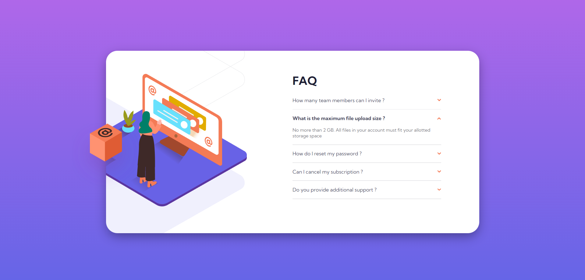
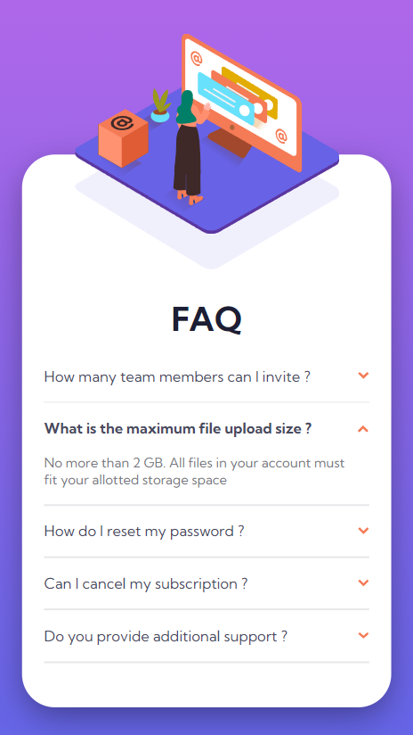

# Frontend Mentor - FAQ accordion card solution

This is a solution to the [FAQ accordion card challenge on Frontend Mentor](https://www.frontendmentor.io/challenges/faq-accordion-card-XlyjD0Oam). Frontend Mentor challenges help you improve your coding skills by building realistic projects. 

## Table of contents

- [Overview](#overview)
  - [The challenge](#the-challenge)
  - [Screenshot](#screenshot)
  - [Links](#links)
- [My process](#my-process)
  - [Built with](#built-with)
  - [Useful resources](#useful-resources)
- [Front-end Style Guide](#Front-end-Style-Guide)

## Overview

### The challenge

Users should be able to:

- View the optimal layout for the component depending on their device's screen size
- See hover states for all interactive elements on the page
- Hide/Show the answer to a question when the question is clicked

### Screenshot of my solution

### Links

- Live demo: [Click here](https://marinvcq.github.io/faq-accordion-card/)

## My process

### Built with

- Semantic HTML5 markup
- CSS custom properties
- Flexbox
- SASS and mixins
- Mobile-first workflow
- JS Vanilla

### Useful resources

- [Collapsibles/Accordion](https://www.w3schools.com/howto/howto_js_accordion.asp) - This helped me to make accordion.

## Front-end Style Guide

### Layout

The designs were created to the following widths:

- Mobile: 375px
- Desktop: 1440px

### Colors

#### Primary

##### Text

- Very dark desaturated blue: hsl(238, 29%, 16%)
- Soft red: hsl(14, 88%, 65%)

##### Gradient

Background gradient:

- Soft violet: hsl(273, 75%, 66%)
- Soft blue: hsl(240, 73%, 65%)

#### Neutral

##### Text

- Very dark grayish blue: hsl(237, 12%, 33%)
- Dark grayish blue: hsl(240, 6%, 50%)

##### Dividers

- Light grayish blue: hsl(240, 5%, 91%)

### Typography

#### Body Copy

- Font size: 12px

#### Font

- Family: [Kumbh Sans](https://fonts.google.com/specimen/Kumbh+Sans)
- Weights: 400, 700

